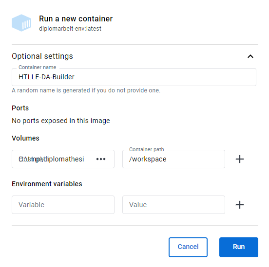

# Docker container

The provided `Dockerfile` can be used to create a dockerized build environment where all depenencies are satisfied.

## Building the environment

In order to build a Docker container (in this example it will be namend `diplomarbeit-env`) just run the following command on a docker host (Tested with Docker 27.2.0)

```sh
docker build -t htlle-da-builder .
```

This creates a container that contains all dependencies and expects to find your diploma thesis mounted into the `/workspace` folder.

Alternatively, the image can be pulled from the [Docker Hub](https://hub.docker.com/r/bytebang/htlle-da-builder).

## Usage

One can build the diploma thesis by running the following command:

```sh
docker run -it --rm -v $(pwd):/workspace htlle-da-builder
```

This command runs the diplomarbeit-env container interactively, mounts the current directory into the container at `/workspace` and automatically cleans the container up after it exits.

Errors and log messages are shown in the console, the file will be written back to the `/workspace` folder.
This also works with *Docker Desktop*.



### Targets

One cannot just build the diploma thesis with the Docker image (**pdf**), but also use environment variables or command line arguments to make a spellcheck over your files (**spellcheck**), print out the compiled raw LaTeX file for debugging (**tex**) or manually delete the staging directory if something went wrong and it was not deleted automatically (**clean**).

The accepted inputs / build targets, with default set to pdf, are:

- pdf
- spellcheck
- tex
- clean

When using environment variables, the one to use is `TARGET`. In Docker Desktop `TARGET` can be entered on the left site (**Variable**) and on the right site (**Value**) the desired build target. When using the command line, the environment variable can be set like this *(replace `input` with a build target)*:

```sh
docker run -it --rm -e TARGET=input -v $(pwd):/workspace htlle-da-builder
```

When using command line arguments, it looks like this *(replace `input` with a build target)*:

```sh
docker run -it --rm -v $(pwd):/workspace htlle-da-builder input
```

**Authors:** Günther Hutter, Marko Schrempf
