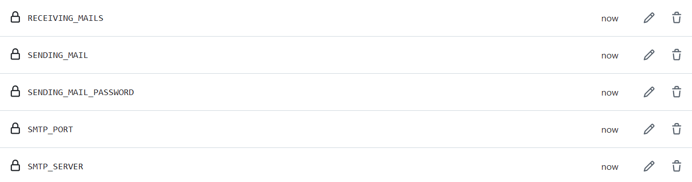

# Build and send diploma thesis

The workflow `Build and send diploma thesis` allows the user to build the diploma thesis via a GitHub workflow and send it somwhere (e.g. to a Microsoft Teams channel). The built diploma thesis can also be downloaded as a [GitHub Action workflow artifact](https://docs.github.com/en/actions/managing-workflow-runs-and-deployments/managing-workflow-runs/downloading-workflow-artifacts).

## Microsoft Teams

1. [Create your own team](https://support.microsoft.com/en-us/office/create-and-organize-teams-ea9aa9c2-ae29-44ca-b838-4424b4daa44d) for the diploma thesis.
2. [Create a new channel](https://support.microsoft.com/en-us/office/create-a-standard-private-or-shared-channel-in-microsoft-teams-fda0b75e-5b90-4fb8-8857-7e102b014525) in your team preferably named `build`.
3. Get the channels [email address](https://support.microsoft.com/en-us/office/tip-send-email-to-a-channel-2c17dbae-acdf-4209-a761-b463bdaaa4ca).

## GitHub

### Repository

Create a folder `.github/workflows` in the root of your repository. You can now paste `thesis.yml` into the newly created folder. It uses the published GitHub Action provided by the [da-base-template](https://github.com/HTL-Leoben/da-base-template) repository and has an approximate runtime of 3 minutes. If one does not want to be dependent on the base repository, the `action.yml` of it can be copied into the root of the target repository. After that the **uses** section of the `thesis.yml` must be changed accordingly to reflect the changed path.

Note, that the whole workflow will fail if the diploma thesis file size is too large when sending it, or if any input parameter is incorrect. Regarding the first case, a fix would be either to reduce the size of included images and PDFs or not use the send option. Regardless, the built diploma thesis is always saved as an [artifact](https://docs.github.com/en/actions/writing-workflows/choosing-what-your-workflow-does/storing-and-sharing-data-from-a-workflow#about-workflow-artifacts) in the latest **successful** workflow run.

### Inputs

| Name | Required | Description | Default |
| - | - | - | - |
| mail | `false` | The email address from which the diploma thesis should be sent from. See [notes](#notes). <br> Required if the diploma thesis should be sent somewhere (e.g. Microsoft Teams). | - |
| mail-password | `false` | The password for your email address. See [notes](#notes). <br> Required if the diploma thesis should be sent somewhere (e.g. Microsoft Teams). | - |
| smtp-server | `false` | The SMTP server URL corresponding to your email address. <br> Required if the diploma thesis should be sent somewhere (e.g. Microsoft Teams). | - |
| smtp-port | `false` | The SMTP port corresponding to your SMTP server. <br> Required if the diploma thesis should be sent somewhere (e.g. Microsoft Teams). | - |
| receiving-mails | `false` | Required if the diploma thesis should be sent somewhere (e.g. Microsoft Teams). <br> If the desired recipient is a Microsoft Teams channel, use its channel email address. <br> Supports a comma-seperated list of email addresses. | - |
| mail-body | `false` | Change the email body (e.g. the message in Microsoft Teams). | [`git log -1 --pretty=%B`](https://git-scm.com/docs/git-log) |
| target | `false` | The target used to build the diploma thesis. <br> It supports one target per run which is one out of pdf, spellcheck or tex. | pdf |
| send-mail-on-target | `false` | Comma-separated list of targets that trigger an email notification. <br> It supports the same targets as in `target` and all. | pdf |
| thesis-path | `false` | Change the folder name where the template is located. | Diplomarbeit |
| output-dir | `false` | The name of the compilation output folder placed inside the `thesis-path`. | out |
| docker-registry | `false` | Change the Docker registry from which the Docker image gets pulled. | docker.io |
| docker-namespace | `false` | Change the Docker namespace from which the Docker image gets pulled. | bytebang |
| docker-image | `false` | Change the Docker image name from which the Docker image gets pulled. | htlle-da-builder |
| docker-tag | `false` | Change the Docker tag which the Docker image should use. | latest |
| manual-mode | `false` | If the repository should not be checked out automatically, specify the complete workspace path to `thesis-path`. | [actions/checkout](https://github.com/actions/checkout) |

### Usage

Only build:

```yml
- name: Build And Send Diploma Thesis
  uses: HTL-Leoben/da-base-template@main
```

Build and send:

```yml
- name: Build And Send Diploma Thesis
  uses: HTL-Leoben/da-base-template@main
  with:
    mail: ${{ secrets.SENDING_MAIL }}
    mail-password: ${{ secrets.SENDING_MAIL_PASSWORD }}
    smtp-server: ${{ secrets.SMTP_SERVER }}
    smtp-port: ${{ secrets.SMTP_PORT }}
    receiving-mails: ${{ secrets.RECEIVING_MAILS }}
```

When building multiple targets at the same time a [matrix](https://docs.github.com/en/actions/how-tos/write-workflows/choose-what-workflows-do/run-job-variations) is used to pass the different targets into a parallelized execution stage. Note, that those targets are the same as specified in the [inputs](#inputs):

```yml
jobs:
  build-send:
    runs-on: ubuntu-latest
    strategy:
      fail-fast: true
      matrix:
        target: [pdf, spellcheck, tex]

  steps:
    - name: Build And Send Diploma Thesis
      uses: HTL-Leoben/da-base-template@main
      with:
        target: ${{ matrix.target }}
```

Only build using an independent `action.yml`:

```yml
steps:
  - name: Checkout Repository
    uses: actions/checkout@v7

  - name: Build And Send Diploma Thesis
    uses: ./
```

### Secrets

In your GitHub repository you need to [create the secrets](https://docs.github.com/en/actions/security-for-github-actions/security-guides/using-secrets-in-github-actions#creating-secrets-for-a-repository) the Action needs with the information from your corresponding accounts if you want to send an email / message containing the built diploma thesis.

| Name | Usage |
| - | - |
| SENDING_MAIL | The email address from which the diploma thesis should be sent from. |
| SENDING_MAIL_PASSWORD | The password for the email address corresponding to `SENDING_MAIL`. |
| SMTP_SERVER | The SMTP server for the email address defined in `SENDING_MAIL`. |
| SMTP_PORT | The SMTP port corresponding to `SMTP_SERVER`. |
| RECEIVING_MAILS | The recipients email addresses. If the desired recipient is a Microsoft Teams channel, use its channel email address. |

After creating the secrets it should look like this:



## Notes

- Sending the diploma thesis and thus automated emails using a school email address (Microsoft 365) is not supported. Therefore, use an email address, that does not correspond to your school email address.
- If you use Gmail as a sending email address, you have to generate an [app password](https://support.google.com/accounts/answer/185833) and use this instead of your normal password.
- You can only then see the Microsoft Teams channel email address, if the creator of the team already viewed it once before.

**Author:** [Marko Schrempf](https://github.com/bitsneak)
